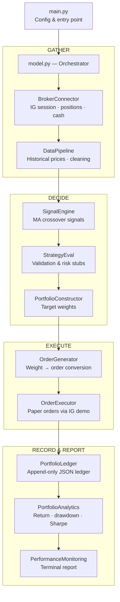

# Tradinator

A modular trading engine for automated **paper trading** on the IG brokerage platform, limited to equity spot markets.

> **DISCLAIMER:** Tradinator is a personal experimentation tool for paper trading.
> It does not constitute trading advice, investment recommendation, or financial
> guidance of any kind. Use at your own risk.

## Architecture

Tradinator follows a strict linear pipeline. Each run is a complete cycle: **connect → decide → execute → record → report**. The orchestrator (`model.py`) calls ten components in fixed order; data flows forward only.



## Structure

```
Tradinator/
├── main.py                           # Entry point: config + Model(config).run()
├── model.py                          # Orchestrator
├── model_components/
│   ├── __init__.py                   # Exports all 10 component classes
│   ├── broker_connector.py           # IG API connectivity & account state
│   ├── data_pipeline.py              # Market data acquisition & cleaning
│   ├── signal_engine.py              # Buy/sell signal generation (MA crossover)
│   ├── strategy_eval.py              # Pre-trade signal validation
│   ├── portfolio_constructor.py      # Signal → target weight conversion
│   ├── order_generator.py            # Target weight → order translation
│   ├── order_executor.py             # Paper trade execution via IG demo
│   ├── portfolio_ledger.py           # Position/cash/trade history (JSON)
│   ├── portfolio_analytics.py        # Return, drawdown, Sharpe calculation
│   ├── performance_monitoring.py     # Formatted performance report
│   └── templates/
│       └── dashboard.html            # Jinja2 HTML dashboard template
├── data/
│   ├── input/                        # Instrument lists, cached data
│   └── output/                       # Ledger, trades, reports
├── secrets/
│   └── .env.example                  # IG credential template
├── requirements.txt
└── README.md
```

## Setup

```bash
# 1. Install dependencies
pip install -r requirements.txt

# 2. Configure IG demo credentials
cp secrets/.env.example secrets/.env
# Edit secrets/.env with your IG demo account details

# 3. Run
python main.py
```

In VS Code, the workspace is configured to use `.venv\\Scripts\\python.exe` for Python Run actions.

### Environment variables

| Variable | Required | Description |
|---|---|---|
| `IG_USERNAME` | Yes | IG demo account username |
| `IG_PASSWORD` | Yes | IG demo account password |
| `IG_API_KEY` | Yes | IG API key |
| `IG_ACC_TYPE` | No | Must be `DEMO` (default) |
| `IG_ACC_NUMBER` | No | Specific account number |

## Configuration

Major parameters are set in `main.py`:

```python
config = {
    "env_path": "secrets/.env",
    "universe": ["CS.D.AAPL.CFD.IP", "CS.D.MSFT.CFD.IP", ...],
    "resolution": "DAY",
    "lookback": 50,
    "max_position_pct": 0.25,
    "cash_reserve_pct": 0.05,
    "output_dir": "data/output",
}
```

Minor parameters (indicator windows, risk-free rate, display width, etc.) are listed at the top of each component class.

## Components

| Component | Purpose |
|---|---|
| **BrokerConnector** | Connects to IG demo, reads positions, cash, account balance |
| **DataPipeline** | Fetches historical OHLCV prices via IG, cleans with forward/back-fill |
| **SignalEngine** | Dual moving-average crossover → BUY / SELL / HOLD signals |
| **StrategyEval** | Pre-trade quality gate: data quality, Sharpe estimate, volatility stubs |
| **PortfolioConstructor** | Converts validated BUY signals into target weights with position caps |
| **OrderGenerator** | Computes delta between target and current portfolio → order list |
| **OrderExecutor** | Sends market orders to IG demo, confirms acceptance |
| **PortfolioLedger** | Append-only JSON record of positions, cash, and trade history |
| **PortfolioAnalytics** | Computes total return, period return, max drawdown, Sharpe ratio |
| **PerformanceMonitoring** | Prints formatted report to terminal, saves text and HTML dashboard |

## Phase 1 scope

This is a **structural skeleton** with placeholder logic where appropriate:

- Signal generation uses a simple MA crossover (placeholder)
- Strategy validation includes Sharpe/volatility stubs
- Portfolio construction is long-only with proportional weighting
- No short selling, no backtesting engine, no production-grade risk handling
- **Paper trading only** — the DEMO constraint is enforced in code

## Adding a new component

1. Create `model_components/mycomponent.py` with a class and a `run()` method
2. Import and export it in `model_components/__init__.py`
3. Instantiate it in `model.py` and call `self.mycomponent.run(...)` inside `Model.run()`

## License

For personal use only. Not financial advice.
