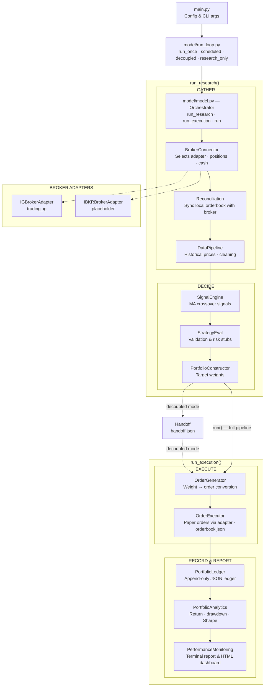
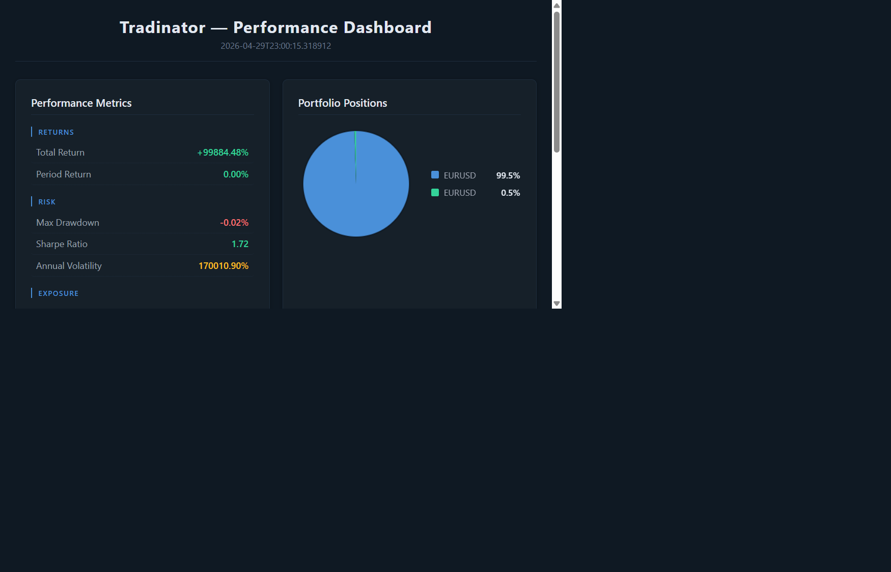

# Tradinator

A modular trading engine for automated **paper trading**, supporting multiple brokerages via a pluggable adapter layer. Connected to the IG platform; IBKR support is scaffolded.

> **DISCLAIMER:** Tradinator is a personal experimentation tool for paper trading.
> It does not constitute trading advice, investment recommendation, or financial
> guidance of any kind. Use at your own risk. ALL CONTENT IN THIS REPOSITORY IS IN THE PUBLIC DOMAIN  AND CAN BE USED FOR RESEARCH PURPOSES (INDIVIDUAL OR COMMERCIAL ENTITIES) ONLY

## Architecture

Eleven components run across four phases (**GATHER → DECIDE → EXECUTE → RECORD/REPORT**). The orchestrator (`model/model.py`) exposes three entry points — `run_research()` (GATHER + DECIDE), `run_execution()` (EXECUTE + RECORD/REPORT), and `run()` (all four phases). A `RunLoop` (`model/run_loop.py`) controls *when* each entry point fires, supporting four run modes including a decoupled mode where research and execution run on independent schedules connected by a `Handoff` file.

A **BrokerAdapter** protocol decouples the pipeline from any specific brokerage. The `BrokerConnector` selects the adapter named in `config["broker"]` (default `"ig"`), and all downstream components call normalised adapter methods — the raw broker client never leaks into the pipeline.



## Structure

```
Tradinator/
├── main.py                           # Entry point: config, CLI args, launches RunLoop
├── model/
│   ├── __init__.py                   # Re-exports Model, RunLoop, Handoff
│   ├── model.py                      # Orchestrator (run_research / run_execution / run)
│   ├── run_loop.py                   # Scheduling: run_once, scheduled, decoupled, research_only
│   ├── handoff.py                    # JSON bridge between research and execution (decoupled mode)
│   └── model_components/
│       ├── __init__.py               # Exports all component classes
│       ├── broker_adapter.py         # BrokerAdapter Protocol (interface)
│       ├── ig_adapter.py             # IG implementation of BrokerAdapter
│       ├── ibkr_adapter.py           # IBKR placeholder (NotImplementedError)
│       ├── broker_connector.py       # Adapter selection & broker_state assembly
│       ├── reconciliation.py         # Sync local orderbook with broker working orders
│       ├── data_pipeline.py          # Market data acquisition & cleaning
│       ├── signal_engine.py          # Buy/sell signal generation (MA crossover)
│       ├── strategy_eval.py          # Pre-trade signal validation
│       ├── portfolio_constructor.py  # Signal → target weight conversion
│       ├── order_generator.py        # Target weight → order translation
│       ├── order_executor.py         # Paper trade execution via adapter, orderbook persistence
│       ├── portfolio_ledger.py       # Position/cash/trade history (JSON)
│       ├── portfolio_analytics.py    # Return, drawdown, Sharpe calculation
│       ├── performance_monitoring.py # Formatted performance report
│       └── templates/
│           └── dashboard.html        # Jinja2 HTML dashboard template
├── data/
│   ├── input/
│   │   ├── universe.json             # Instrument universe (epic list + metadata)
│   │   ├── discover_universe.py      # Validates epics against IG API
│   │   ├── universe_series.xlsx      # Master time series (auto-generated)
│   │   └── historic_series/          # Drop-in folder for historic xlsx files
│   └── output/                       # Ledger, trades, orderbook, reports
├── secrets/
│   └── .env.example                  # Credential template (IG + IBKR stubs)
├── requirements.txt
└── README.md
```

## Setup

```bash
# 1. Install dependencies
pip install -r requirements.txt

# 2. Configure broker credentials (default: IG demo)
cp secrets/.env.example secrets/.env
# Edit secrets/.env with your IG demo account details

# 3. Run (default: single full pipeline run)
python main.py

# Run in a specific mode
python main.py --mode research_only       # research phase only, once
python main.py --mode scheduled --interval 3600
python main.py --mode decoupled --research-interval 14400 --execution-interval 3600
```

### Command-line arguments

| Argument | Default | Description |
|---|---|---|
| `--mode` | `run_once` | `run_once`, `scheduled`, `decoupled`, or `research_only` |
| `--interval` | `3600` | Seconds between runs in `scheduled` mode |
| `--research-interval` | `14400` | Seconds between research cycles in `decoupled` mode |
| `--execution-interval` | `3600` | Seconds between execution cycles in `decoupled` mode |

### Environment variables

#### IG (default broker)

| Variable | Required | Description |
|---|---|---|
| `IG_USERNAME` | Yes | IG demo account username |
| `IG_PASSWORD` | Yes | IG demo account password |
| `IG_API_KEY` | Yes | IG API key |
| `IG_ACC_TYPE` | No | Must be `DEMO` (default) |
| `IG_ACC_NUMBER` | No | Specific account number |

#### IBKR (not yet implemented)

| Variable | Required | Description |
|---|---|---|
| `IBKR_HOST` | No | Gateway host (default `127.0.0.1`) |
| `IBKR_PORT` | No | Gateway port (default `4002` for paper) |
| `IBKR_CLIENT_ID` | No | API client ID (default `1`) |

## Configuration

Major parameters are set in `main.py`:

```python
config = {
    "broker": "ig",                    # "ig" or "ibkr" (ibkr is placeholder)
    "env_path": "secrets/.env",
    "universe_path": "data/input/universe.json",
    "universe": [...],                 # loaded from universe.json at startup
    "resolution": "DAY",
    "lookback": 50,
    "max_position_pct": 0.25,
    "cash_reserve_pct": 0.05,
    "output_dir": "data/output",
    "max_handoff_age_seconds": 7200,   # staleness threshold for decoupled handoff
}
```

The instrument universe is loaded from `data/input/universe.json` at startup. Duplicate epic variants (e.g. `.DAILY.IP` and `.IFD.IP` for the same base) are deduplicated automatically. Run `data/input/discover_universe.py` to validate epics against the IG API.

Minor parameters (indicator windows, risk-free rate, display width, etc.) are listed at the top of each component class.

## Broker Abstraction

The `BrokerAdapter` protocol (`model/model_components/broker_adapter.py`) defines eight methods that every adapter must implement:

| Method | Purpose |
|---|---|
| `connect()` | Authenticate and establish a session |
| `get_account_info()` | Return cash and balance |
| `get_positions()` | Return normalised open positions |
| `fetch_historical_prices()` | Return OHLCV bars for an instrument |
| `fetch_instrument_info()` | Return display name and currency |
| `open_position()` | Place an order to open a position |
| `close_position()` | Place an order to close a position |
| `confirm_deal()` | Check acceptance/rejection of a deal |

### Adding a new broker

1. Create `model/model_components/mybroker_adapter.py` implementing the `BrokerAdapter` protocol
2. Import it in `model/model_components/__init__.py`
3. Register it in `model/model_components/broker_connector.py` `_ADAPTER_REGISTRY`
4. Set `"broker": "mybroker"` in `main.py` config

## Components

| Component | Purpose |
|---|---|
| **BrokerAdapter** | Protocol defining the normalised broker interface |
| **IGBrokerAdapter** | IG implementation (trading_ig library) |
| **IBKRBrokerAdapter** | IBKR placeholder (not yet implemented) |
| **BrokerConnector** | Selects adapter, connects, builds broker_state |
| **Reconciliation** | Syncs local orderbook against broker working orders; detects fills, cancellations, and expirations |
| **DataPipeline** | Fetches historical OHLCV prices via adapter, cleans with forward/back-fill, persists a master xlsx time series, and can ingest historic data files |
| **SignalEngine** | Dual moving-average crossover → BUY / SELL / HOLD signals |
| **StrategyEval** | Pre-trade quality gate: data quality, Sharpe estimate, volatility stubs |
| **PortfolioConstructor** | Converts validated BUY signals into target weights with position caps |
| **OrderGenerator** | Computes delta between target and current portfolio → order list; respects per-instrument `min_deal_size` and `lot_size` from metadata |
| **OrderExecutor** | Sends MARKET and LIMIT orders via adapter, confirms acceptance, persists an `orderbook.json` with order states |
| **PortfolioLedger** | Append-only JSON record of positions, cash, and trade history |
| **PortfolioAnalytics** | Computes total return, period return, max drawdown, Sharpe ratio |
| **PerformanceMonitoring** | Terminal report, text file, and HTML dashboard on port 8742 with JS data polling; metrics configurable per-entry via `METRICS_CONFIG` (enable/disable, label, suffix, colour); includes a positions pie chart |

## Dashboard

Served on port 8742, the dashboard auto-opens in the browser on the first run and stays accessible at `http://localhost:8742/performance_dashboard.html` until the process is stopped with Ctrl+C.



## Universe Series

`DataPipeline` maintains a master time series file at `data/input/universe_series.xlsx`. The file is updated automatically on every pipeline run as a non-blocking side effect — a write failure will not interrupt the pipeline.

### File layout

The xlsx file contains three sheets:

| Sheet | Content |
|---|---|
| `mid_close` | Mid-price close (bid + ask) / 2 |
| `bid_close` | Bid close |
| `mid_open` | Mid-price open (bid + ask) / 2 |

Each sheet has a datetime index (rows sorted ascending, oldest at top) and one column per instrument in the universe.

### Historic data ingestion

To backfill or supplement the master file with external data:

1. Place `.xlsx` files in `data/input/historic_series/`. Each file must follow the same schema: three sheets (`mid_close`, `bid_close`, `mid_open`), datetime index, numeric values, one column per instrument.
2. Files are validated on load — any file that fails schema checks is skipped with a warning.
3. On merge, existing master values take precedence over historic values where timestamps and instruments overlap.

Historic ingestion runs automatically during every pipeline run. It can also be invoked standalone:

```python
from model.model_components import DataPipeline
DataPipeline(config={}).ingest_historic()
```

## Phase 1 scope

- Signal generation uses a simple MA crossover
- Strategy validation includes Sharpe/volatility stubs
- Portfolio construction is long-only with proportional weighting
- No short selling, no backtesting engine, no production-grade risk handling
- **Paper trading only** — the DEMO constraint is enforced in code

## Adding a new component

1. Create `model/model_components/mycomponent.py` with a class and a `run()` method
2. Import and export it in `model/model_components/__init__.py`
3. Instantiate it in `model/model.py` and call it inside `run_research()` or `run_execution()` depending on which phase it belongs to

## License

For personal use only. Not financial advice.
