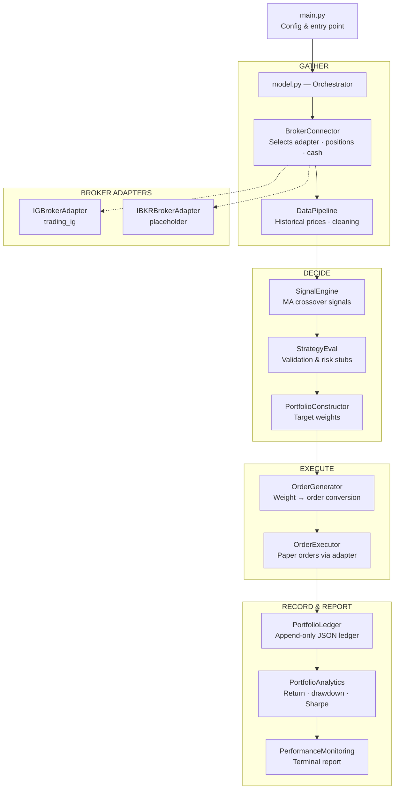

# Tradinator

A modular trading engine for automated **paper trading**, supporting multiple brokerages via a pluggable adapter layer. Currently connected to the IG platform; IBKR support is scaffolded as a placeholder.

> **DISCLAIMER:** Tradinator is a personal experimentation tool for paper trading.
> It does not constitute trading advice, investment recommendation, or financial
> guidance of any kind. Use at your own risk.

## Architecture

Tradinator follows a strict linear pipeline. Each run is a complete cycle: **connect → decide → execute → record → report**. The orchestrator (`model.py`) calls ten components in fixed order; data flows forward only.

A **BrokerAdapter** protocol decouples the pipeline from any specific brokerage. The `BrokerConnector` selects the adapter named in `config["broker"]` (default `"ig"`), and all downstream components call normalised adapter methods — the raw broker client never leaks into the pipeline.



## Structure

```
Tradinator/
├── main.py                           # Entry point: config + Model(config).run()
├── model.py                          # Orchestrator
├── model_components/
│   ├── __init__.py                   # Exports all component classes
│   ├── broker_adapter.py             # BrokerAdapter Protocol (interface)
│   ├── ig_adapter.py                 # IG implementation of BrokerAdapter
│   ├── ibkr_adapter.py              # IBKR placeholder (NotImplementedError)
│   ├── broker_connector.py           # Adapter selection & broker_state assembly
│   ├── data_pipeline.py              # Market data acquisition & cleaning
│   ├── signal_engine.py              # Buy/sell signal generation (MA crossover)
│   ├── strategy_eval.py              # Pre-trade signal validation
│   ├── portfolio_constructor.py      # Signal → target weight conversion
│   ├── order_generator.py            # Target weight → order translation
│   ├── order_executor.py             # Paper trade execution via adapter
│   ├── portfolio_ledger.py           # Position/cash/trade history (JSON)
│   ├── portfolio_analytics.py        # Return, drawdown, Sharpe calculation
│   └── performance_monitoring.py     # Formatted performance report
├── data/
│   ├── input/                        # Instrument lists, cached data
│   │   ├── universe_series.xlsx      # Master time series (auto-generated)
│   │   └── historic_series/          # Drop-in folder for historic xlsx files
│   └── output/                       # Ledger, trades, reports
├── secrets/
│   └── .env.example                  # Credential template (IG + IBKR stubs)
├── requirements.txt
└── README.md
```

## Setup

```bash
# 1. Install dependencies
pip install -r requirements.txt

# 2. Configure broker credentials (default: IG demo)
cp secrets/.env.example secrets/.env
# Edit secrets/.env with your IG demo account details

# 3. Run
python main.py
```

In VS Code, the workspace is configured to use `.venv\\Scripts\\python.exe` for Python Run actions.

### Environment variables

#### IG (default broker)

| Variable | Required | Description |
|---|---|---|
| `IG_USERNAME` | Yes | IG demo account username |
| `IG_PASSWORD` | Yes | IG demo account password |
| `IG_API_KEY` | Yes | IG API key |
| `IG_ACC_TYPE` | No | Must be `DEMO` (default) |
| `IG_ACC_NUMBER` | No | Specific account number |

#### IBKR (placeholder — not yet implemented)

| Variable | Required | Description |
|---|---|---|
| `IBKR_HOST` | No | Gateway host (default `127.0.0.1`) |
| `IBKR_PORT` | No | Gateway port (default `4002` for paper) |
| `IBKR_CLIENT_ID` | No | API client ID (default `1`) |

## Configuration

Major parameters are set in `main.py`:

```python
config = {
    "broker": "ig",                    # "ig" or "ibkr"
    "env_path": "secrets/.env",
    "universe": ["CS.D.AAPL.CFD.IP", "CS.D.MSFT.CFD.IP", ...],
    "resolution": "DAY",
    "lookback": 50,
    "max_position_pct": 0.25,
    "cash_reserve_pct": 0.05,
    "output_dir": "data/output",
}
```

Minor parameters (indicator windows, risk-free rate, display width, etc.) are listed at the top of each component class.

## Broker Abstraction

The `BrokerAdapter` protocol (`model_components/broker_adapter.py`) defines eight methods that every adapter must implement:

| Method | Purpose |
|---|---|
| `connect()` | Authenticate and establish a session |
| `get_account_info()` | Return cash and balance |
| `get_positions()` | Return normalised open positions |
| `fetch_historical_prices()` | Return OHLCV bars for an instrument |
| `fetch_instrument_info()` | Return display name and currency |
| `open_position()` | Place an order to open a position |
| `close_position()` | Place an order to close a position |
| `confirm_deal()` | Check acceptance/rejection of a deal |

### Adding a new broker

1. Create `model_components/mybroker_adapter.py` implementing the `BrokerAdapter` protocol
2. Import it in `model_components/__init__.py`
3. Register it in `broker_connector.py` `_ADAPTER_REGISTRY`
4. Set `"broker": "mybroker"` in `main.py` config

## Components

| Component | Purpose |
|---|---|
| **BrokerAdapter** | Protocol defining the normalised broker interface |
| **IGBrokerAdapter** | IG implementation (trading_ig library) |
| **IBKRBrokerAdapter** | IBKR placeholder (not yet implemented) |
| **BrokerConnector** | Selects adapter, connects, builds broker_state |
| **DataPipeline** | Fetches historical OHLCV prices via adapter, cleans with forward/back-fill, persists a master xlsx time series, and can ingest historic data files |
| **SignalEngine** | Dual moving-average crossover → BUY / SELL / HOLD signals |
| **StrategyEval** | Pre-trade quality gate: data quality, Sharpe estimate, volatility stubs |
| **PortfolioConstructor** | Converts validated BUY signals into target weights with position caps |
| **OrderGenerator** | Computes delta between target and current portfolio → order list |
| **OrderExecutor** | Sends market orders via adapter, confirms acceptance |
| **PortfolioLedger** | Append-only JSON record of positions, cash, and trade history |
| **PortfolioAnalytics** | Computes total return, period return, max drawdown, Sharpe ratio |
| **PerformanceMonitoring** | Prints formatted report to terminal, saves to text file |

## Universe Series

`DataPipeline` maintains a master time series file at `data/input/universe_series.xlsx`. The file is updated automatically on every pipeline run as a non-blocking side effect — a write failure will not interrupt the pipeline.

### File layout

The xlsx file contains three sheets:

| Sheet | Content |
|---|---|
| `mid_close` | Mid-price close (bid + ask) / 2 |
| `bid_close` | Bid close |
| `mid_open` | Mid-price open (bid + ask) / 2 |

Each sheet has a datetime index (rows sorted ascending, oldest at top) and one column per instrument in the universe.

### Historic data ingestion

To backfill or supplement the master file with external data:

1. Place `.xlsx` files in `data/input/historic_series/`. Each file must follow the same schema: three sheets (`mid_close`, `bid_close`, `mid_open`), datetime index, numeric values, one column per instrument.
2. Files are validated on load — any file that fails schema checks is skipped with a warning.
3. On merge, existing master values take precedence over historic values where timestamps and instruments overlap.

Historic ingestion runs automatically during every pipeline run. It can also be invoked standalone:

```python
from model_components import DataPipeline
DataPipeline(config={}).ingest_historic()
```

## Phase 1 scope

This is a **structural skeleton** with placeholder logic where appropriate:

- Signal generation uses a simple MA crossover (placeholder)
- Strategy validation includes Sharpe/volatility stubs
- Portfolio construction is long-only with proportional weighting
- No short selling, no backtesting engine, no production-grade risk handling
- **Paper trading only** — the DEMO constraint is enforced in code

## Adding a new component

1. Create `model_components/mycomponent.py` with a class and a `run()` method
2. Import and export it in `model_components/__init__.py`
3. Instantiate it in `model.py` and call `self.mycomponent.run(...)` inside `Model.run()`

## License

For personal use only. Not financial advice.
