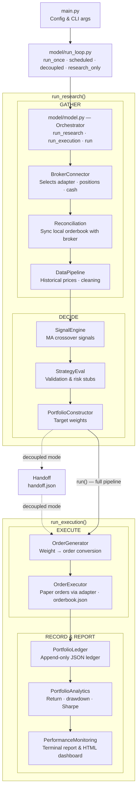

# Tradinator

A modular trading engine for automated **paper trading**, connected to the IG platform.

> **DISCLAIMER:** Tradinator is a personal experimentation tool for paper trading.
> It does not constitute trading advice, investment recommendation, or financial
> guidance of any kind. Use at your own risk. ALL CONTENT IN THIS REPOSITORY IS IN THE PUBLIC DOMAIN  AND CAN BE USED FOR RESEARCH PURPOSES (INDIVIDUAL OR COMMERCIAL ENTITIES) ONLY

## Table of Contents

- [1. Architecture](#1-architecture)
- [2. Structure](#2-structure)
- [3. Setup](#3-setup)
  - [3.1 Command-line arguments](#31-command-line-arguments)
  - [3.2 Environment variables](#32-environment-variables)
    - [3.2.1 IG (default broker)](#321-ig-default-broker)
- [4. Configuration](#4-configuration)
- [5. Inputs](#5-inputs)
  - [5.1 Observable Universe](#51-observable-universe)
  - [5.2 Time Series Data](#52-time-series-data)
    - [5.2.1 Historic series files](#521-historic-series-files)
- [6. Components](#6-components)
- [7. Dashboard](#7-dashboard)
- [8. Universe Series](#8-universe-series)
  - [8.1 File layout](#81-file-layout)
  - [8.2 Historic data ingestion](#82-historic-data-ingestion)
- [9. License](#9-license)

## 1. Architecture

Eleven components run across four phases (**GATHER → DECIDE → EXECUTE → RECORD/REPORT**). The orchestrator (`model/model.py`) exposes three entry points — `run_research()` (GATHER + DECIDE), `run_execution()` (EXECUTE + RECORD/REPORT), and `run()` (all four phases). A `RunLoop` (`model/run_loop.py`) controls *when* each entry point fires, supporting four run modes including a decoupled mode where research and execution run on independent schedules connected by a `Handoff` file.



## 2. Structure

```
Tradinator/
├── main.py                           # Entry point: config, CLI args, launches RunLoop
├── model/
│   ├── __init__.py                   # Re-exports Model, RunLoop, Handoff
│   ├── model.py                      # Orchestrator (run_research / run_execution / run)
│   ├── run_loop.py                   # Scheduling: run_once, scheduled, decoupled, research_only
│   ├── handoff.py                    # JSON bridge between research and execution (decoupled mode)
│   └── model_components/
│       ├── __init__.py               # Exports all component classes
│       ├── ig_adapter.py             # IG implementation of BrokerAdapter
│       ├── broker_connector.py       # Adapter selection & broker_state assembly
│       ├── reconciliation.py         # Sync local orderbook with broker working orders
│       ├── data_pipeline.py          # Market data acquisition & cleaning
│       ├── signal_engine.py          # Buy/sell signal generation (MA crossover)
│       ├── strategy_eval.py          # Pre-trade signal validation
│       ├── portfolio_constructor.py  # Signal → target weight conversion
│       ├── order_generator.py        # Target weight → order translation
│       ├── order_executor.py         # Paper trade execution via adapter, orderbook persistence
│       ├── portfolio_ledger.py       # Position/cash/trade history (JSON)
│       ├── portfolio_analytics.py    # Return, drawdown, Sharpe calculation
│       ├── performance_monitoring.py # Formatted performance report
│       └── templates/
│           └── dashboard.html        # Jinja2 HTML dashboard template
├── data/
│   ├── input/
│   │   ├── universe.json             # Instrument universe (epic list + metadata)
│   │   ├── discover_universe.py      # Validates epics against IG API
│   │   ├── universe_series.xlsx      # Master time series (auto-generated)
│   │   └── historic_series/          # Drop-in folder for historic xlsx files
│   └── output/                       # Ledger, trades, orderbook, reports
├── secrets/
│   └── .env.example                  # Credential template (IG + IBKR stubs)
├── requirements.txt
└── README.md
```

## 3. Setup

```bash
# 1. Install dependencies
pip install -r requirements.txt

# 2. Configure broker credentials (default: IG demo)
cp secrets/.env.example secrets/.env
# Edit secrets/.env with your IG demo account details

# 3. Run (default: single full pipeline run)
python main.py

# Run in a specific mode
python main.py --mode research_only       # research phase only, once
python main.py --mode scheduled --interval 3600
python main.py --mode decoupled --research-interval 14400 --execution-interval 3600
```

### 3.1 Command-line arguments

| Argument | Default | Description |
|---|---|---|
| `--mode` | `run_once` | `run_once`, `scheduled`, `decoupled`, or `research_only` |
| `--interval` | `3600` | Seconds between runs in `scheduled` mode |
| `--research-interval` | `14400` | Seconds between research cycles in `decoupled` mode |
| `--execution-interval` | `3600` | Seconds between execution cycles in `decoupled` mode |

### 3.2 Environment variables

#### 3.2.1 IG (default broker)

| Variable | Required | Description |
|---|---|---|
| `IG_USERNAME` | Yes | IG demo account username |
| `IG_PASSWORD` | Yes | IG demo account password |
| `IG_API_KEY` | Yes | IG API key |
| `IG_ACC_TYPE` | No | Must be `DEMO` (default) |
| `IG_ACC_NUMBER` | No | Specific account number |

*An abstraction layer allows for easy migration to other brokers — see the [Broker Migration skill](skills/change_brokers.md).*

## 4. Configuration

Major parameters are set in `main.py`:

```python
config = {
    "broker": "ig",
    "env_path": "secrets/.env",
    "universe_path": "data/input/universe.json",
    "universe": [...],                 # loaded from universe.json at startup
    "resolution": "DAY",
    "lookback": 5,
    "max_position_pct": 0.25,
    "cash_reserve_pct": 0.05,
    "output_dir": "data/output",
    "max_handoff_age_seconds": 7200,   # staleness threshold for decoupled handoff
}
```

Minor parameters (indicator windows, risk-free rate, display width, etc.) are listed at the top of each component class.

## 5. Inputs

Tradinator reads two input files at pipeline startup: a universe definition and a master price series.

| Term | Definition |
|---|---|
| **epic** | IG's unique instrument identifier (e.g. `IX.D.FTSE.DAILY.IP`) |
| **universe** | The set of instruments the system knows about and may trade |
| **candidate** | A universe instrument whose epic has not been validated against the IG Demo API |
| **verified** | A universe instrument confirmed to return price data on the IG Demo API via `discover_universe.py` |

### 5.1 Observable Universe

`data/input/universe.json` defines 30 instruments:

| Asset class | Count | Regions |
|---|---|---|
| Indices | 15 | UK, US, EU, APAC |
| Forex | 9 | Global |
| Commodities | 6 | Global |

Five are verified; the remaining 25 are candidates. Only verified instruments are eligible for data fetches and signal generation.

| Verified epic | Instrument |
|---|---|
| `IX.D.FTSE.DAILY.IP` | FTSE 100 |
| `IX.D.SPTRD.DAILY.IP` | S&P 500 |
| `CS.D.EURUSD.MINI.IP` | EUR/USD Mini |
| `CS.D.GBPUSD.MINI.IP` | GBP/USD Mini |
| `CC.D.CL.UMP.IP` | Crude Oil (WTI) |

Epic status is set by running `data/input/discover_universe.py`, which validates each epic against the IG Demo API and **replaces** `universe.json` with only the instruments that pass validation — candidates that fail are removed entirely, not merely flagged. If fewer than 20 epics pass Phase 1, the script runs a second phase that queries the IG search endpoint for approximately 35 terms (indices, forex pairs, commodities) and appends any newly discovered valid epics to the file. Status is not set manually. Duplicate epic variants (e.g. `.DAILY.IP` and `.IFD.IP` for the same base) are deduplicated at pipeline startup.

### 5.2 Time Series Data

`data/input/universe_series.xlsx` is the master price series, written by `DataPipeline` on every run. The current file holds **13 epics** over **125 rows** (2026-02-18 to 2026-05-01).

| Sheet | Content |
|---|---|
| `mid_close` | Mid-price close — (bid + ask) / 2 |

The sheet holds the same 13 epic columns and 125-row datetime index as before.

All 5 verified epics are present in the series. Of the remaining 8 stored epics, 4 are actual universe candidates and 4 are not present in `universe.json` at all:

- 3 are variant orphans — stored under a different epic suffix than their entry in `universe.json` (e.g. `IX.D.DAX.IFD.IP` stored; `IX.D.DAX.DAILY.IP` in universe)
- 1 (`IX.D.HANGSENG.DAILY.IP`) has no matching base instrument in `universe.json` at all (universe carries `IX.D.HSENG.DAILY.IP`)

The 21 remaining universe instruments — all candidates — have no stored series.

On merge, live data takes precedence over existing master values at the same timestamp — stored rows are overwritten by freshly fetched bars. Historic-file data has the lowest precedence: existing master values win over historic-file values on overlap. Precedence order (highest to lowest): live fetched data > existing master values > historic file data.

### 5.2.1 Historic series files

`data/input/historic_series/` accepts `.xlsx` files with a `mid_close` sheet to backfill the master series. The folder is currently empty. Files are validated on load; any file that fails a schema check is skipped with a warning. Ingestion runs automatically on every pipeline run.

## 6. Components

| Component | Purpose |
|---|---|
| **BrokerConnector** | Selects adapter, connects, builds broker_state |
| **Reconciliation** | Syncs local orderbook against broker working orders; detects fills, cancellations, and expirations |
| **DataPipeline** | Fetches historical OHLCV prices via adapter, cleans with forward/back-fill, persists a master xlsx time series, and can ingest historic data files |
| **SignalEngine** | Dual moving-average crossover → BUY / SELL / HOLD signals |
| **StrategyEval** | Pre-trade quality gate: data quality, Sharpe estimate, volatility stubs |
| **PortfolioConstructor** | Converts validated BUY signals into target weights with position caps |
| **OrderGenerator** | Computes delta between target and current portfolio → order list; respects per-instrument `min_deal_size` and `lot_size` from metadata |
| **OrderExecutor** | Sends MARKET and LIMIT orders via adapter, confirms acceptance, persists an `orderbook.json` with order states |
| **PortfolioLedger** | Append-only JSON record of positions, cash, and trade history |
| **PortfolioAnalytics** | Computes total return, period return, max drawdown, Sharpe ratio |
| **PerformanceMonitoring** | Terminal report, text file, and HTML dashboard on port 8742 with JS data polling; metrics configurable per-entry via `METRICS_CONFIG` (enable/disable, label, suffix, colour); includes a positions pie chart |

## 7. Dashboard

Served on port 8742, the dashboard auto-opens in the browser on the first run and stays accessible at `http://localhost:8742/performance_dashboard.html` until the process is stopped with Ctrl+C.


## 8. Universe Series

`DataPipeline` writes `data/input/universe_series.xlsx` as a non-blocking side effect — a write failure will not interrupt the pipeline.

### 8.1 File layout

Each sheet has a datetime index (rows sorted ascending, oldest at top) and one column per instrument in the universe.

### 8.2 Historic data ingestion

To backfill or supplement the master file with external data, place `.xlsx` files in `data/input/historic_series/`. Each file must follow the same schema: a `mid_close` sheet, datetime index, numeric values, one column per instrument.

Historic ingestion can also be triggered standalone:

```python
from model.model_components import DataPipeline
DataPipeline(config={}).ingest_historic()
```

## 9. License

Public domain. Permitted for research purposes by individuals and commercial entities. Not financial advice.
